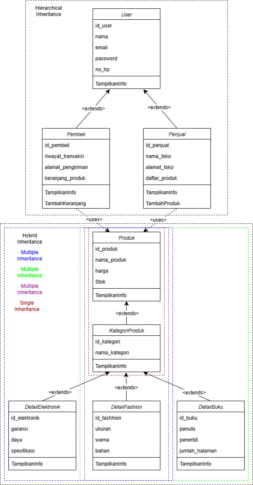
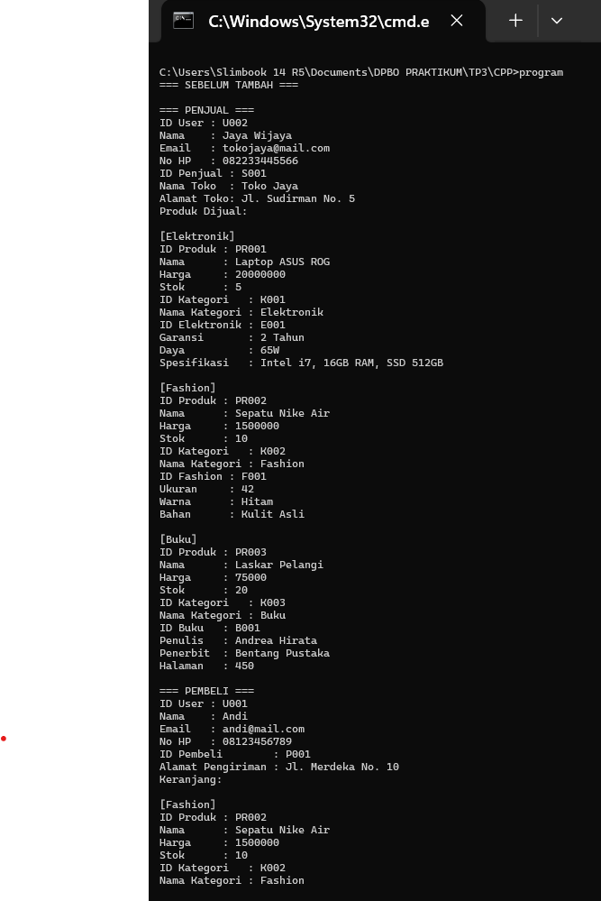
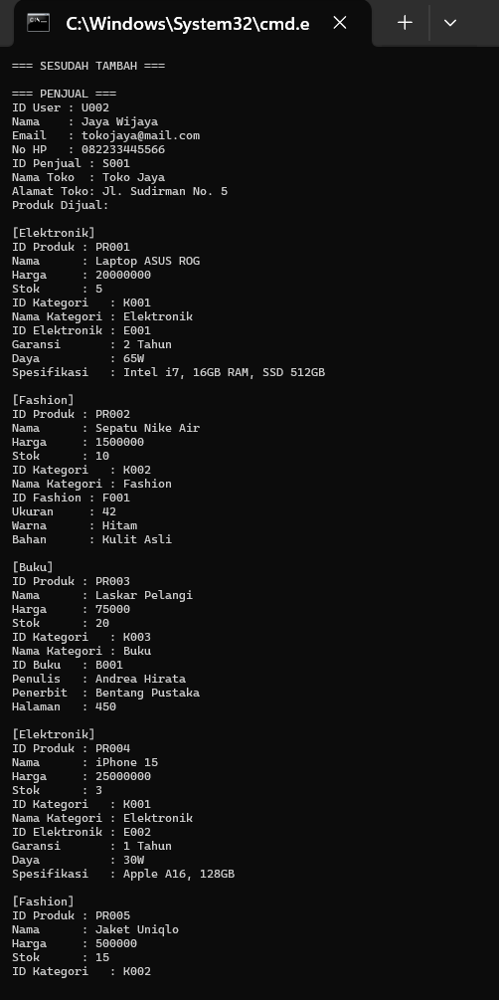
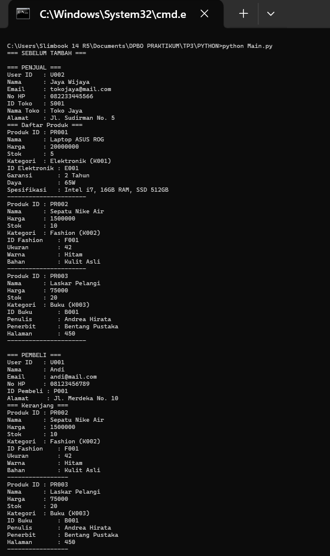
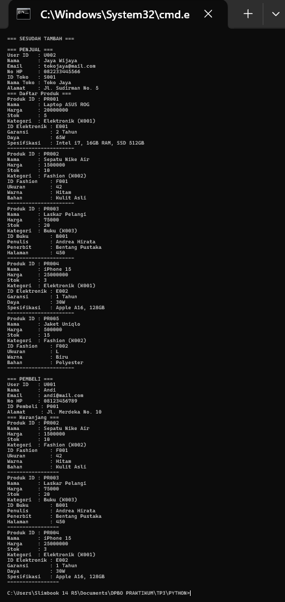
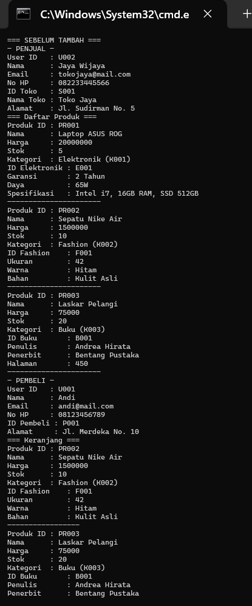
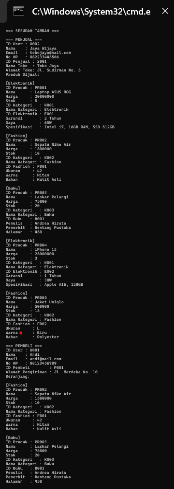

# TP3DPBO2425C2
## JANJI
Saya Shakila Aulia dengan NIM 2403086 mengerjakan Tugas Praktikum 3 dalam mata kuliah Desain dan Pemograman Berorientasi Objek untuk keberkahanNya maka saya tidak melakukan kecurangan seperti yang telah dispesifikasikan. Aamiin

---
## DESAIN DIAGRAM, ATRIBUT DAN METHODS
**Desain**

Untuk desain sendiri menggunakan 8 class yaitu IdentitasProduk, KategoriProduk, dan Spesifikasi Produk, yang memiliki atribut dan method:
1. User
User merupakan parent dari Pembeli dan Penjual. Hubungan ketiganya merupakan Hierarchical Inheritance. Dibuat untuk menampilkan identitas dasar berupa akun dari Pembeli dan Penjual yaitu:
Atribut
- idUser
- nama
- email
- password
- no_hp

Method
- TampilkanInfo() -> untuk menampilkan info User

2. Pembeli
Merupakan child dari User, sehingga atribut User diturunkan dalam class ini. Dibuat untuk menampilkan detail terkait Pembeli yaitu:
Atribut
- id_pembeli
- alamat_pengiriman
- keranjang_produk

Method 
- TampilkanInfo() -> untuk menampilkan info Pembeli
- TambahKeranjang() -> menambahkan list produk yang dibeli oleh pembeli

3. Penjual
Merupakan child dari User, sehingga atribut User diturunkan dalam class ini. Dibuat untuk menampilkan detail terkait Penjual yaitu:
Atribut
- id_penjual
- nama_toko
- alamat_toko
- daftar_produk

Method
- TampilkanInfo() -> untuk menampilkan info Penjual
- TambahProduk() -> menambahkan list produk yang dijual oleh pembeli

4. Produk
Produk berelasi dengan pembeli dan penjual berupa hubungan composite, karena disini pembeli dan penjual sama-sama memiliki (HAS A) produk. Dibuat untuk menampilkan info dari produk yang ada yaitu:
Atribut
- id_produk
- nama_produk
- harga
- stok

Method
- TampilkanInfo() -> untuk menampilkan info produknya

5. KategoriProduk
lass ini merupakan child dari Produk sehingga berelasi single inheritance, sehingga atribut produk diturunkan ke class ini. Dibuat untuk menampilkan info lebih detail yaitu kategorri dari produk yang ada yaitu:
Atribut
- id_kategori
- nama_kategori
  
Method
- TampilkanInfo() -> untuk menampilkan info kategori produknya

5. KategoriProduk
Class ini merupakan child dari Produk sehingga berelasi single inheritance, sehingga atribut produk diturunkan ke class ini. Dibuat untuk menampilkan info lebih detail yaitu kategorri dari produk yang ada yaitu:
Atribut
- id_kategori
- nama_kategori
  
Method
- TampilkanInfo() -> untuk menampilkan info kategori produknya

6. DetailElektronik
Detail elektronik ini merupakan child dari kategori dimana tadi disebutkan kategori merupakan child juga dari produk, sehingga relasinya merupakan multiple inheritance. Sehingga atribut detail elektronik mendapat turunan dari kategori dan produk. Dibuat untuk menampilkan info lebih detail dari masing-masing kategorri dari produk yang ada khususnya barang elektronik yaitu:
Atribut
- id_elektronik
- garansi
- daya
- spesifikasi
  
Method
- TampilkanInfo() -> untuk menampilkan info detail elektronik

7. DetailFashion
Detail fashion ini merupakan child dari kategori dimana tadi disebutkan kategori merupakan child juga dari produk, sehingga relasinya merupakan multiple inheritance. Sehingga atribut detail fashion mendapat turunan dari kategori dan produk. Dibuat untuk menampilkan info lebih detail dari masing-masing kategorri dari produk yang ada khususnya barang elektronik yaitu:
Atribut
- id_fashion
- ukuran
- warna
- bahan
  
Method
- TampilkanInfo() -> untuk menampilkan info detail fashion

8. DetailBuku
Detail buku ini merupakan child dari kategori dimana tadi disebutkan kategori merupakan child juga dari produk, sehingga relasinya merupakan multiple inheritance. Sehingga atribut detail buku mendapat turunan dari kategori dan produk. Dibuat untuk menampilkan info lebih detail dari masing-masing kategorri dari produk yang ada khususnya barang buku yaitu:
Atribut
- id_buku
- pemulis
- penerbit
- jumlah_halaman
  
Method
- TampilkanInfo() -> untuk menampilkan info detail fashion

**Desain Program**
Program ini didesain untuk merepresentasikan interaksi antara pengguna (Penjual dan Pembeli) dengan produk (Elektronik, Fashion, Buku). Untuk detail relasi dijelaskan di dokum sebelumnya.

**Kode Flow**
Penjelasan Kode Flow dari tiap bahasa:
1. C++, Java, PYTHON
     - Program mulai dari Main.cpp untuk membuat data secara hardcode dengan memasukkannya ke dalam list object
     - Menampilkan data yang sudah dimasukkan sebelumnya
     - Menambahkan data baru dengan membuat data secara hardcode dengan memasukkannya ke dalam list object
     - Menampilkan kembali dengan data yang sudah bertambah

---
## DOKUMENTASI
**Tampilan Output CLI (CPP)**

**Tampilan Output CLI (PYTHON)**

**Tampilan Output CLI (JAVA)**

*Dokumentasi lebih lanjut berupa screen record ada dalam folder dokumentasi
